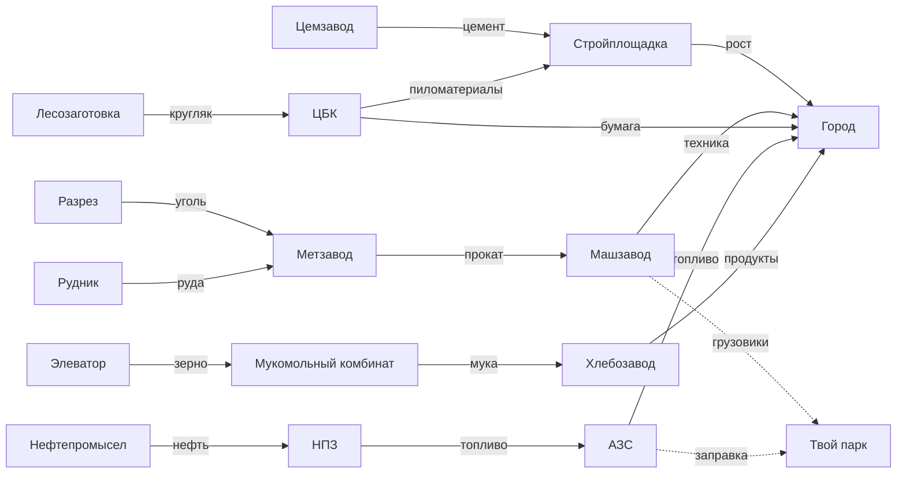

# «ПЛЕЧО» — концепт

Симулятор грузовой логистики. Браузер, изометрия, реальная Россия, 1994 → 2030-е.

> Игра делается **в портфолио**. Проектируется как глубокий тайкун на десятки
> часов, ориентир по плотности систем — Transport Fever и OpenTTD.

---

## 0. Что это, а что нет

**Не** биржа контрактов, где берёшь заказ «отвези A→B за N рублей». Это доска
объявлений, а не игра.

**А** экономический симулятор, где ты строишь транспортную сеть, и мир на неё
реагирует: предприятия работают, только если ты возишь их сырьё и продукцию;
города растут, только если их снабжают; выросший город требует больше — и твоя
сеть перестаёт справляться.

Игрок не выполняет задания. Игрок **создаёт экономику и потом чинит её узкие
места**.

---

## 1. Одной фразой

Ты поднимаешь автотранспортную компанию с одного убитого ЗИЛа в 1994 году до
федеральной сети, связывая заводы, элеваторы, НПЗ и города в работающую
промышленную цепь — против конкурента, которым управляет языковая модель.

---

## 2. Производственные цепочки — фундамент

Каждое предприятие потребляет вход и производит выход. **Без вывоза продукции
завод останавливается. Без подвоза сырья — тоже.** Пока не приехала твоя машина,
экономика стоит.



Две петли замыкаются на игрока и делают систему самореферентной:

- **Топливная.** Твои фуры жрут топливо. Топливо делает НПЗ из нефти, которую
  везёшь ты. Наладил свою цепь нефть → НПЗ → АЗС — заправляешься дешевле всех.
  Порвалась цепь — у тебя дорожает всё разом.
- **Машинная.** Машзаводу нужен прокат, чтобы делать грузовики, которые покупаешь
  ты. Снабжаешь метзавод — растёт доступность и падает цена техники.

Это не украшение. Это то, что превращает набор маршрутов в **систему, где всё
влияет на всё**.

---

## 3. Линии, а не поездки

Игрок **не отправляет машины по одной**. Это микроменеджмент, он утомляет и не
масштабируется.

Игрок **проектирует линию**: последовательность остановок с указанием, что
грузится и что выгружается на каждой. Потом ставит на линию N машин и настраивает
интервал.

```
ЛИНИЯ «Тульское кольцо»
  Москва-Южный терминал   ← выгрузка: продукты    → загрузка: удобрения
  Тула-элеватор           ← выгрузка: удобрения   → загрузка: зерно
  Тула-мукомольный        ← выгрузка: зерно       → загрузка: мука
  Москва-хлебозавод       ← выгрузка: мука        → загрузка: —
  [замкнуть на начало]

  Машин на линии: 4     Средняя загрузка: 87%     Рентабельность: +42 000/мес
```

Дальше начинается настоящий геймплей: **диагностика**. Линия убыточна — почему?
Машины простаивают на погрузке? Терминал не справляется? Одно плечо идёт
порожняком? Зерно кончилось, потому что элеватору не хватает удобрений? Машин на
линии больше, чем нужно, и они возят воздух?

Игра — это чтение метрик и починка сети. Как в Transport Fever.

---

## 4. Обратная загрузка

Ядро сохраняется, но теперь работает на порядок интереснее. Раньше это было
«найди парный контракт». Теперь — **спроектируй кольцо через производственную
цепь так, чтобы ни одно плечо не шло пустым**.

Кольцо выше не случайно: удобрения в Тулу, зерно на комбинат, мука в Москву. Три
плеча, ни одного порожнего. Найти такое кольцо в реальной географии и реальной
цепочке — это головоломка, и она масштабируется: кольца из пяти плеч, кольца
через два региона, кольца с перевалкой на терминале.

Метрика **порожнего пробега** выносится на видное место — процент километров, где
машина ехала пустой. Хороший игрок держит его ниже 15%. Это единственное число,
которое отличает мастера от новичка, и вокруг него строится вся оптимизация.

---

## 5. Города как живая система

Город — не точка на карте, а потребитель со структурой спроса.

- Потребляет продукты, топливо, бумагу, технику, стройматериалы
- **Растёт**, если снабжается стабильно; стагнирует и сжимается, если нет
- Рост увеличивает потребление и открывает новые предприятия в окрестностях
- У каждого города свой профиль: промышленный, аграрный, транзитный, ресурсный

Обратная связь злая и правильная: наладил снабжение → город вырос → потребление
выросло → твоей сети уже не хватает → расширяйся или потеряешь его конкуренту.

Города берутся реальные, с реальными расстояниями и специализацией. Тольятти —
машиностроение, Череповец — металлургия, Кубань — зерно, Тюмень — нефть. Игрок,
знающий географию страны, получает преимущество, и это приятно.

---

## 6. Инфраструктура

Основная статья капитальных затрат и главное стратегическое решение.

| Объект | Роль |
|---|---|
| **Грузовой терминал** | Точка погрузки и выгрузки. Имеет пропускную способность и число постов. Переполнен — очередь и простой |
| **Склад** | Буфер. Позволяет разорвать плечо и накопить партию под консолидацию |
| **Перевалочный хаб** | Сеть перестаёт быть набором линий и становится топологией: магистральные плечи между хабами плюс развоз |
| **Своя АЗС** | Замыкает топливную петлю |
| **Ремзона** | ТО дешевле и быстрее, чем на стороне |

**Место решает.** Терминал на окраине дешевле, но добавляет километры на каждом
рейсе. Терминал в центре дорог и упирается в пробки. Расположение — это решение
на всю партию, и переиграть его дорого.

---

## 7. Дороги и пропускная способность

Дорожная сеть реальная: федеральные трассы, региональные, местные. У каждой —
пропускная способность, качество покрытия, ограничение по нагрузке на ось.

- Перегруженный участок замедляет всех, включая тебя
- Разбитая дорога повышает износ и расход
- **Весенние ограничения** закрывают часть маршрутов для тяжёлых машин — каждый
  год, предсказуемо, и к этому надо готовиться
- Зимой падает скорость и растёт расход, но растут и ставки

Игрок может лоббировать ремонт трассы, вложив деньги. Дорогое решение на
несколько игровых лет вперёд.

---

## 8. Транспорт и эпохи

Игра идёт по годам с 1994-го. Техника открывается по эпохам, стареет и
обесценивается.

| Период | Техника |
|---|---|
| 90-е | ЗИЛ-130, КамАЗ-5320, МАЗ-5335 — дешёвые, прожорливые, ломучие |
| 2000-е | КамАЗ нового поколения, первые бэушные иномарки, MAN и Volvo из Европы |
| 2010-е | Магистральные тягачи, рефы, низкорамники, спецтехника |
| 2020-е+ | Современные тягачи, газомоторное топливо, телематика, первые беспилотники |

Старая машина не исчезает — она дешевеет в обслуживании до момента, когда
ремонты съедают прибыль. Решение «пора списывать» игрок принимает сам, и оно
всегда нетривиально.

Прицепы отдельно: тент, реф, платформа, цистерна, зерновоз, лесовоз,
контейнеровоз. Тягач без нужного прицепа груз не возьмёт.

---

## 9. Водители

Персонажи, а не строка расходов.

- Навык влияет на расход, аккуратность, риск поломки, скорость
- Допуски: ДОПОГ на опасные, категория на длинномеры
- **Режим труда и отдыха** — обязательные перерывы, тахограф, штрафы за нарушение
- Усталость: уставший едет медленнее и чаще ломает машину
- Зарплата, лояльность, опыт — конкурент переманивает лучших
- Своя автошкола на поздних этапах: растишь кадры вместо найма

---

## 10. Грузы

| Тип | Требование | Особенность |
|---|---|---|
| Генеральный | Тент | База |
| Навалочный | Самосвал, зерновоз | Зерно, щебень, уголь |
| Наливной | Цистерна | Топливо, химия |
| Рефрижераторный | Реф | Порча при срыве срока или поломке |
| Негабарит | Низкорамник | Разрешения, ограничение маршрута и скорости |
| Опасный | ДОПОГ | Допуск водителя, штрафы кратно выше |
| Контейнер | Контейнеровоз | Универсальность, перевалка без перегруза |

---

## 11. Деньги

- Плавающая цена топлива с сезонностью и привязкой к нефти в твоей же экономике
- Ставки на направлениях зависят от спроса, сезона и присутствия конкурентов
- Износ, регламентное ТО, внеплановые поломки, эвакуация
- Лизинг против покупки: лизинг даёт машину сразу, но связывает поток
- Кредиты, кассовые разрывы, банкротство
- Налоги, страховка, платон, штрафы
- **Спот против долгосрочных контрактов** — надстройка над цепочками: крупный
  клиент даёт гарантированный объём по ставке ниже рынка в обмен на стабильность

---

## 12. Конкуренты

Несколько компаний на карте. Большинство скриптовые с разными профилями. Один —
**под управлением языковой модели**.

Раз в игровой месяц модель получает состояние: карту, цепочки, кто какие
направления держит, свой баланс и парк, историю действий игрока. Возвращает
решения — куда расширяться, какие цепочки перехватывать, где строить терминал,
где ронять ставку, кого из водителей переманивать.

Игрок видит ленту рассуждений:

> «Игрок замкнул зерновую цепь на Тулу и вложился в терминал. Лобовое
> столкновение проиграю — у него плечо короче. Захожу в топливо: строю АЗС на
> М-4, перехватываю его же заправки. Параллельно пробую увести водителя с ДОПОГ.»

Личность задаётся промптом: агрессивный, осторожный, нишевый, имитатор. Разные
характеры требуют разных стратегий — отсюда реиграбельность.

Скриптовый фолбэк обязателен: нет сети — игра не ломается.

---

## 13. Прогрессия

| Этап | Содержание |
|---|---|
| Выживание | Один ЗИЛ, три города, зерновая цепь. Хватило бы на солярку |
| Первая линия | Замкнул кольцо, порожний пробег упал, пошла прибыль |
| Специализация | Рефы, наливные, допуски, первый долгосрочный контракт |
| Терминал | Своя точка перевалки. Сеть вместо маршрутов |
| Второй регион | Дальние плечи, сезонность бьёт по-настоящему |
| Топливная независимость | Замкнул нефть → НПЗ → своя АЗС |
| Федеральный уровень | Хабы, магистральные плечи, борьба за цепочки с конкурентом |

Победа: доля рынка или поглощение конкурента. Провал: банкротство.
Отдельно режим песочницы без цели.

---

## 14. Онбординг

Системы включаются по одной, каждая привязана к событию.

Первые минуты — один город, один завод, одна машина, ручной рейс. Появилась
вторая машина — появились линии. Взял реф — появились прицепы. Нанял второго
водителя — появился режим труда. Построил терминал — появилась пропускная
способность.

Игрок ни разу не видит весь интерфейс сразу, но к третьему часу управляет всем.

---

## 15. Арт-дирекшн

Изометрия, low-poly, **вся геометрия генерируется кодом**.

- Города — кластеры параллелепипедов, силуэт зависит от размера и профиля
- Предприятия — узнаваемые силуэты: градирни НПЗ, банки элеватора, трубы завода
- Дороги — сплайны по реальной топологии трасс
- Фуры — простые формы, силуэт различим по классу и прицепу

**Стилевой замок:** сдержанная холодная палитра плюс тёплый оранжевый акцент —
цвет дорожной техники. Светится только акцент.

**Постпроцессинг:** bloom, DOF на дальнем плане, зерно, виньетка, тонмаппинг.

**Сутки, сезоны, эпохи.** Ночью фары и огни городов. Зимой карта белеет. С 90-х к
2020-м меняется палитра — от выцветшей к насыщенной. Дёшево, а на скриншотах и в
трейлере работает сильнее всего остального.

**Генерируется нейросетью:** текстуры покрытий, скайбоксы, иконки грузов и
интерфейса, логотипы компаний, звук, музыка, тексты, рассуждения конкурента.

---

## 16. Стек и архитектура

- Vite + React + TypeScript
- Three.js через React Three Fiber
- Zustand, симуляция полностью отдельно от рендера
- `@react-three/postprocessing`
- Vitest на экономику, Playwright на самопроверку агента
- Gemini API напрямую для конкурента
- Деплой статикой на itch.io

**Главное архитектурное требование.** Симуляция — чистые функции без React. Тик
принимает состояние и возвращает состояние. Это даёт:

- тесты на баланс экономики
- прогон тысячи игровых лет за секунды для настройки
- ускорение времени без переписывания
- детерминированность и воспроизводимость багов
- сохранения как сериализацию состояния

Экономика — это отдельный модуль, который можно запустить без браузера вообще.
На нём стоит вся игра, и он должен быть чистым.

---

## 17. Порядок работы

Вертикальными срезами — на каждом этапе играбельно целиком, просто уже.

1. **Мир** — карта России, города, дороги, изометрия, камера
2. **Экономика** — предприятия, цепочки, производство, потребление, рост городов
3. **Логистика** — машины, ручной рейс, топливо, деньги
4. **Линии** — маршруты с остановками, назначение парка, метрики, порожний пробег
5. **Глубина** — типы грузов и прицепов, классы машин, водители, износ, ТО
6. **Инфраструктура** — терминалы, склады, пропускная способность, узкие места
7. **Конкурент** — скриптовый, затем LLM поверх
8. **Визуал** — арт-дирекшн, постпроцессинг, сутки, сезоны, звук
9. **Слои** — эпохи и техника, долгосрочные контракты, второй регион, репутация
10. **Полировка** — баланс, онбординг, сохранения, трейлер

**Веха к 20 августа:** играбельное состояние с картинкой для заявки в портфолио.
Реалистично — пункты 1–4, то есть работающая экономика с линиями. Этого уже
достаточно, чтобы показать. Дальше работаем сколько нужно.
